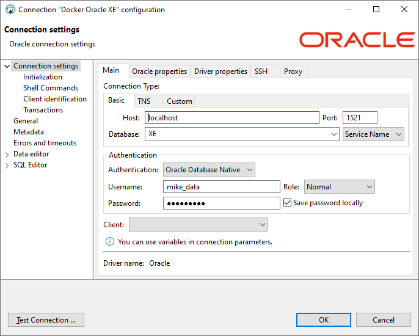

Sample project that creates an Oracle XE database, a user and some tables.

From the database directory run following to build image:

`docker build -t localhost/mike/mike-database .`

Then run with compose:

`docker compose up`

Then connect with:

* `jdbc:oracle:thin:@//localhost:1521/XE`
* `mike_data`
* `mike_data`

Screenshot from DBeaver
